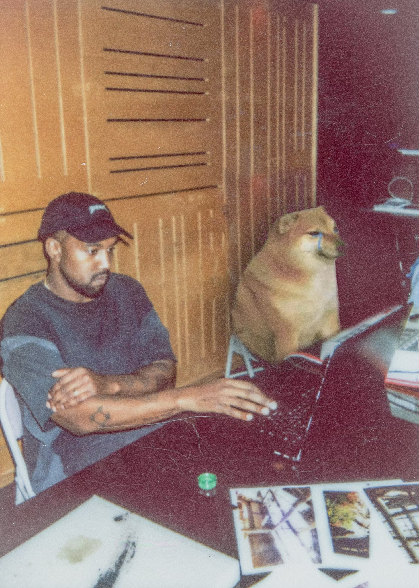

<h1 align="center">Hi , I'm Kurniawan Candra Mahardika</h1>
<h3 align="center">Sigma Code 🗣​</h3>

Junior FrontEnd Developer

 

  
  
  

 

  

  

- 🌱 I’m currently learning **Next JS & React Native**

- 📫 How to reach me **kurniawancandram@gmail.com**

- 🎒 School **President University [PU]**

 
<h3 align="left">Connect with me:</h3>

</a>

 

<h3 align="left">Languages and Tools:</h3>

- Frontend

  

- Tools

  

 

<h3 align="left">GitHub Stats:</h3>

 

  

 
